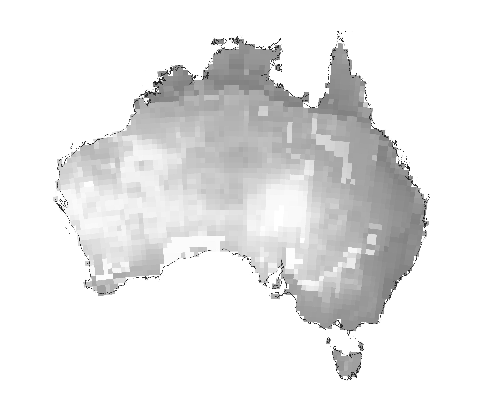
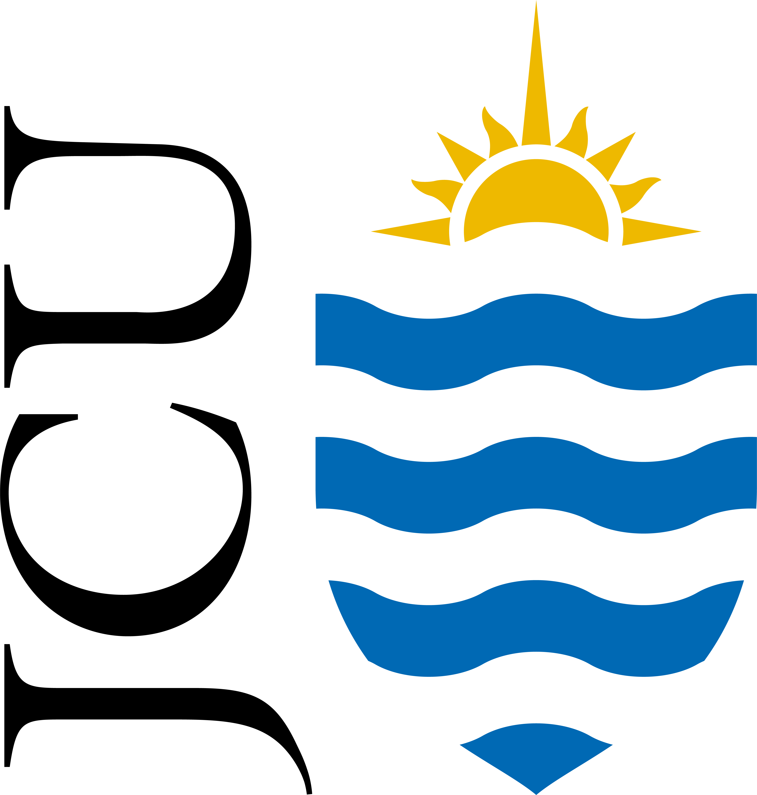

# Net primary production models for Australia to estimate carrying capacity of pre-colonial Indigenous population
### (includes code to compare predictions to anthropological/historical accounts, and a demographic model to estimate the number of excess deaths occurring from pre-colonial period to late 19th Century)

## Focal manuscript
<a href="https://au.linkedin.com/in/alan-williams-7973a958">Williams, AN</a>, <a href="https://www.facebook.com/profile.php?id=100076324899510">K Beller</a>, <a href="https://portfolio.jcu.edu.au/researchers/michael.bird">MI Bird</a>, <a href="https://experts.deakin.edu.au/42085-billy-griffiths">B Griffiths</a>, <a href="https://www.unsw.edu.au/staff/shane-ingrey">S Ingrey</a>, <a href="https://research.monash.edu/en/persons/ian-mcniven">IJ McNiven</a>, <a href="https://www.flinders.edu.au/people/cody.nitschke">MC Nitschke</a>, <a href="https://au.linkedin.com/in/nick-pitt-772440ba">N Pitt</a>, <a href="https://research.monash.edu/en/persons/lynette-russell-am">L Russell</a>, <a href="https://www.flinders.edu.au/people/frederik.saltre">F Saltré</a>, <a href="https://portfolio.jcu.edu.au/researchers/sean.ulm/">S Ulm</a>, <a href="https://discover.utas.edu.au/Christopher.Wilson">C Wilson</a>, <a href="https://www.flinders.edu.au/people/corey.bradshaw">CJA Bradshaw</a>. <a href="">Multi-model estimates of the size of the Australian Indigenous population prior to and its massive decline following colonial invasion</a>. In review

## Abstract
Estimating the size of pre-colonial Indigenous populations in Australia and the magnitude of impact of colonial invasion in 1788 is essential to inform the management of intergenerational trauma and reconciliation, and provide baseline information to apply contemporary socio-economic and environmental activities. Our understanding of these populations is poor due to the early exposure of lethal diseases, extensive frontier violence and killing, and a lack of any systematic censuses. Here we review ethnographic observations, archaeological and genetic reconstructions, and carrying capacity calculated from hindcasted climate models to estimate the abundance of the Indigenous population prior to colonial invasion, and the inferred number of excess deaths in post-colonial times. Congruency of the modelled population size suggests a bootstrapped median of 2.51 million people in the pre-colonial population (75% confidence interval: 1.13–4.41 million, or 0.33 people km-2; 75% confidence interval: 0.15–0.57 km-2) based on these studies, with more recent approaches reflecting higher values in this range. At a median pre-colonial population of 2.51 million, approximately 32,500 excess deaths year-1 (approximately 2.39 million deaths in total) would have had to occur in the late 18th and early 19th Centuries from colonial invasion-related incidents on average to achieve the estimated population of 0.177–0.193 million by 1861 (i.e., 7–8% of the pre-colonial population). These findings highlight the major impact experienced by Indigenous people, and demonstrate a remarkable story of survival, resilience, and recovery over the last 235 years. However, even today, the Indigenous population remains at ~ 32% of its median pre-colonial size, and further efforts in their support must form a focus to achieve reconciliation into the future.

## <a href="https://github.com/cjabradshaw/AusIndigN/tree/main/scripts">Scripts</a>
R code by Corey Bradshaw (<a href="http://github.com/cjabradshaw">@cjabradshaw</a>)

### <a href="https://github.com/cjabradshaw/AusIndigN/tree/main/scripts">base script</a>
- <code>indigN.R</code>: includes all code used to derive estimates reported in the paper mentioned above

### <a href="https://github.com/cjabradshaw/AusIndigN/tree/main/scripts/source">source functions</a>
- <code>matrixOperators.r</code>: functions for manipulating matrices for population projections
- <code>new_lmer_AIC_tables3.r</code>: functions to calculate information-theoretic parameters for linear models
- <code>r.squared.r</code>: functions to calculate goodness of fit for linear models

## <a href="https://github.com/cjabradshaw/AusIndigN/tree/main/data">Data</a>
- <em>NppSahul(0-140ka_rawvalues)_Krapp2021.csv.zip</em>: hindcasted net primary production (kg C m-2 year-1) for 0.5°×0.5° grid cells from 140 ka to the present for Sahul from <a href="http://doi.org/10.1038/s41597-021-01009-3">Krapp et al. (2000)</a> (unzip .csv file first)
- <em>world2013lifetable.csv</em>: age-specific human life-table values from <a href="http://doi.org/10.1073/pnas.1410465111">Bradshaw & Brook (2014)</a>
- <em>bindensModelOverlay.csv</em>: population estimates from <a href="https://www.ucpress.edu/books/constructing-frames-of-reference/paper">Binford (2001)</a> using R package <code>binford</code> (<a href="http://CRAN.R-project.org/package=binford">Marwick et al. 2016</a>) overlayed on carrying-capacity estimates

## R libraries
<code>sp</code>, <code>raster</code>, <code>oceanmap</code>, <code>OceanView</code>, <code>abind</code>, <code>pracma</code>, <code>binford</code>, <code>rgl</code>, <code>scatterplot3d</code>, <code>spatstat</code>, <code>spatialEco</code>, <code>SpatialPack</code>, <code>performance</code>, <code>sjPlot</code>, <code>dismo</code>, <code>gbm</code>, <code>truncnorm</code>, <code>bootstrap</code>

### Acknowledgements
Co-financed by the <a href="https://www.arc.gov.au">Australian Research Council</a> <a href="https://EpicAustralia.org.au">Centre of Excellence for Australian Biodiversity and Heritage</a> (CE170100015) and the <a href="http://ciehf.au">Centre of Excellence for Indigenous and Environmental Histories and Futures</a>.
 

    &nbsp;  &nbsp;  &nbsp;  &nbsp;  &nbsp;  

